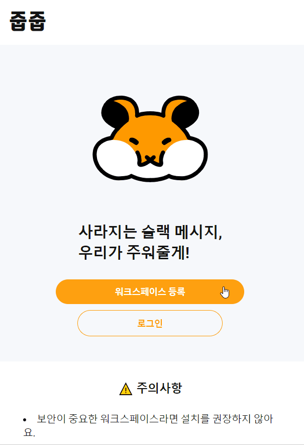
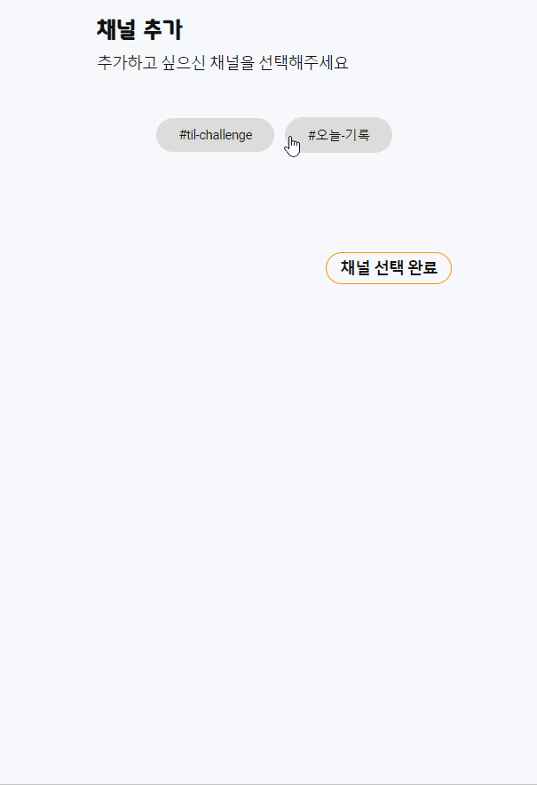
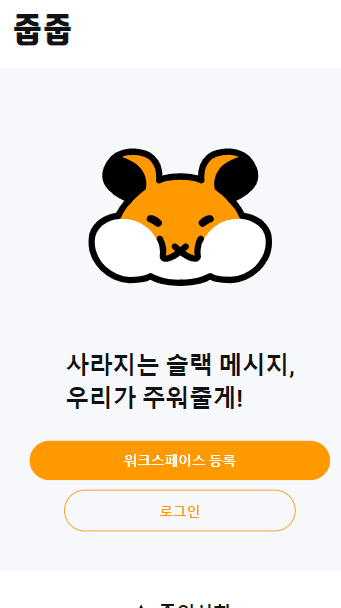

# 목차

1. ⚠ 주의사항
2. ️🌱 새로운 워크스페이스를 등록하실 건가요?
3. 🌻 이미 워크스페이스를 등록하셨나요?

  

# ⚠️ 주의사항

- 보안이 중요한 워크스페이스라면 설치를 권장하지 않아요.
- 워크스페이스 참여자 전원의 동의를 받고 줍줍 워크스페이스를 등록해주세요!
- 줍줍을 체험해보고 싶으신 분들은 [체험 가이드](./체험_가이드.md)를 참고해주세요!

  

# 🌱 새로운 워크스페이스를 등록하실 건가요?

### 1. 워크스페이스 등록

워크스페이스 등록을 클릭하면 줍줍 슬랙 앱이 해당 워크스페이스에 설치되어요.

### 2. 채널 구독

메시지를 확인하시려는 채널을 구독해주세요.
앞으로는 줍줍이 설치된 채널의 메시지가 백업되어요. (줍줍 설치 이전 메시지는 백업되지 않아요 👀)

### 3. 슬랙 이용

마음껏 슬랙을 이용해주세요!
프로필 이미지를 변경하거나, 메시지를 작성하거나 삭제하고, 채널을 생성하는 등 줍줍에서 모든 변경 사항을 확인할 수 있어요.

  

# 🌻 이미 워크스페이스를 등록하셨나요?

줍줍이 설치된 워크스페이스에 로그인해서 백업된 메시지를 확인해주세요!

  
