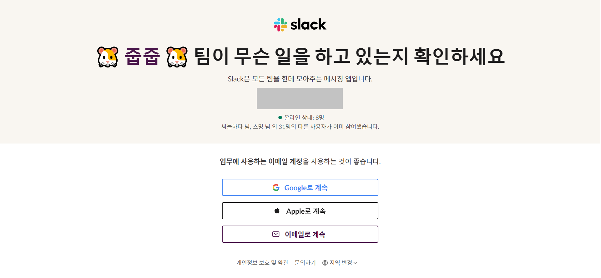
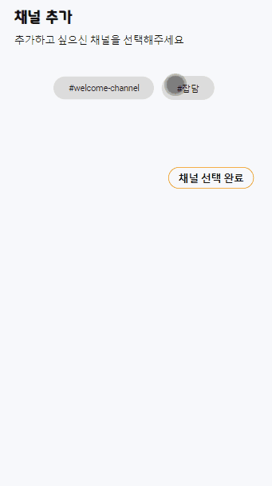

# 줍줍 체험 가이드

> 줍줍 서비스를 체험해보고 싶은 분들을 위한 가이드 문서

### 1. 줍줍 워크스페이스에 가입

[Slack 초대 링크](https://join.slack.com/t/jupjup/shared_invite/zt-1iluljldw-~YqxTYewoBP~LImxtg6eSw)를 통해 줍줍의 워크스페이스에 가입해주세요.

 

### 2. 로그인

줍줍 사이트에 들어와 로그인을 해주세요.

 

### 3. 구독할 채널 선택

구독하고 싶으신 채널을 선택해주세요.

 

### 4. 서비스 이용

슬랙에 자유롭게 메시지를 작성하고 줍줍에서 확인해보세요!  
서비스 이용에 대한 자세한 가이드는 [여기](./서비스_이용_가이드.md)를 참고 부탁드려요.

 
